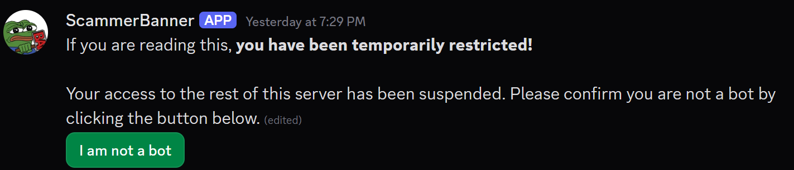
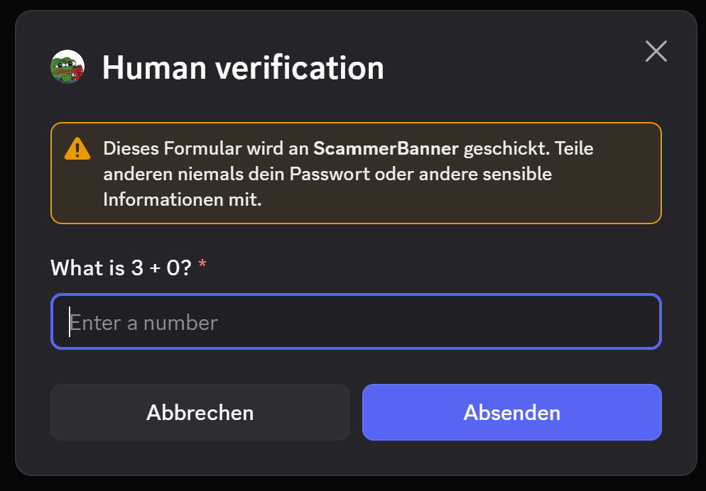
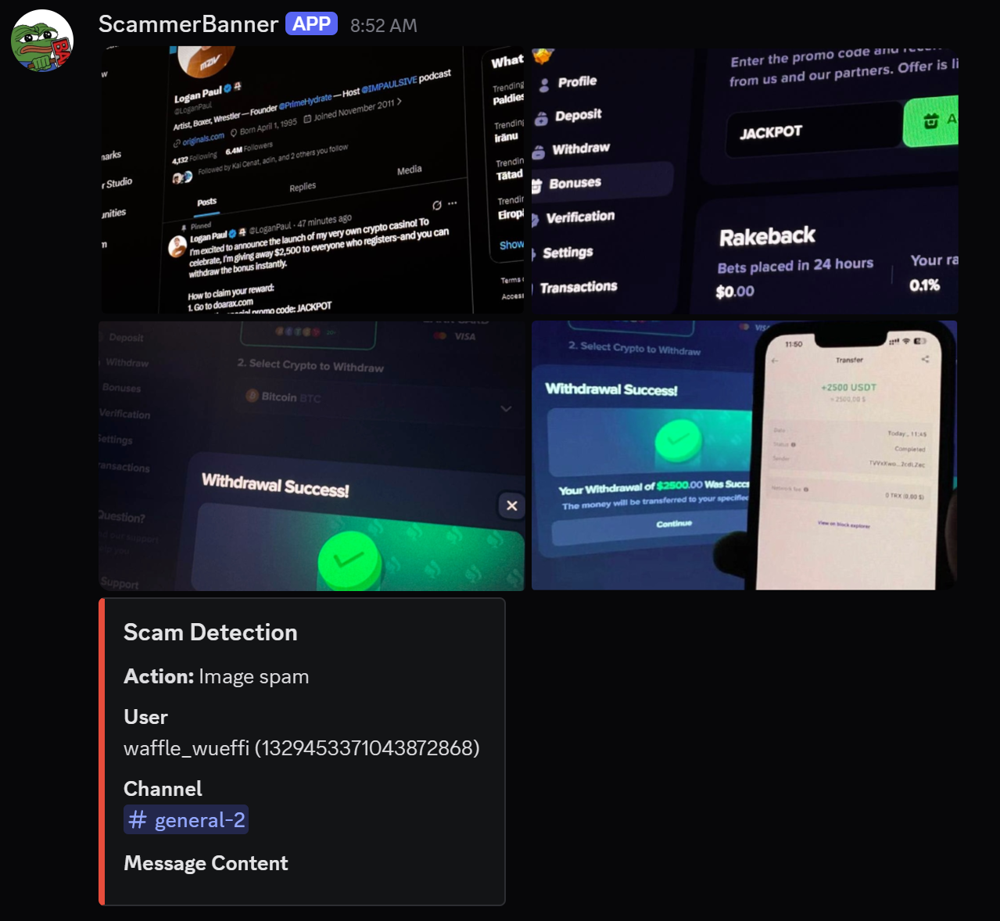
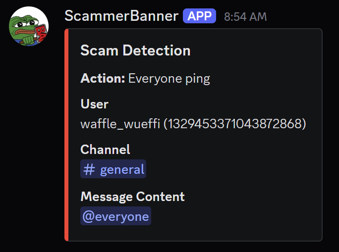
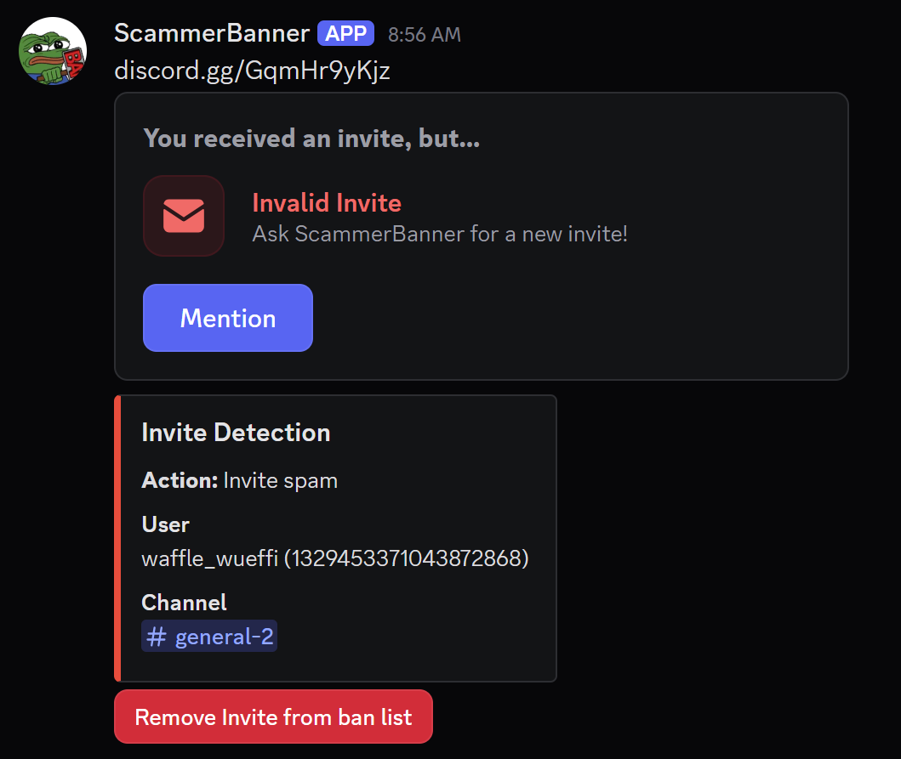
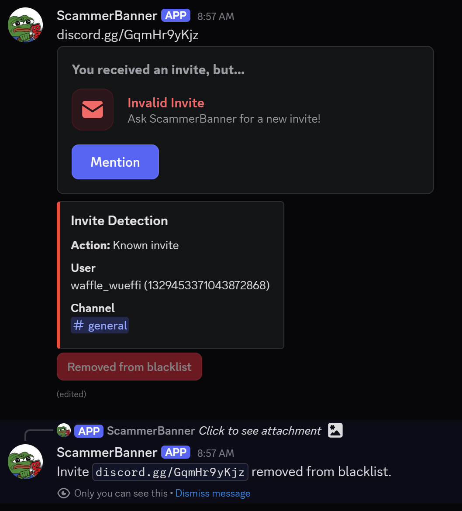

# ScammerBanner
Discord bot that automatically detects Spammers/Scammers/Hacked/Bot Accounts and moves them to a temporary channel.

Invite: https://discord.com/oauth2/authorize?client_id=1493265924374134937

## ⚙️ Setup
If you want to self-host Scammer-Banner, paste your Bot-Token into the `.env`. If you want the bot to log it's actions, also paste the logs channel's ID. You can also configure the name and color of the role, aswell as the temporary ban channels name and welcome message.

## ⚠️ Actions that lead to Punishment
- Sending four or more images twice in 10 seconds
- Trying to mention `@everyone`
- Sending a discord invite twice in 60 seconds
- Sending a known scam discord invite
-> Your messages will get removed, and you will get sent into the temporary bans channel.

## ✅ Restoring Access
To restore your access to the server, click "I am not a robot" and solve the simple captcha. 

## 📜 Logs

